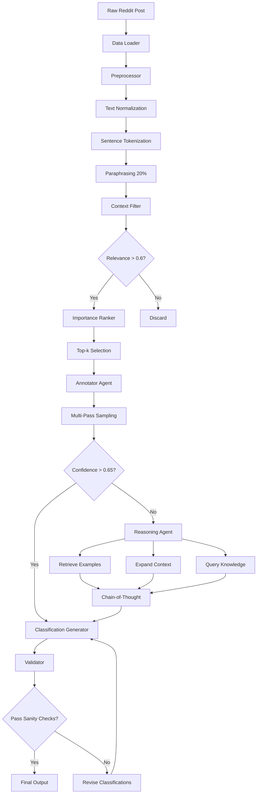
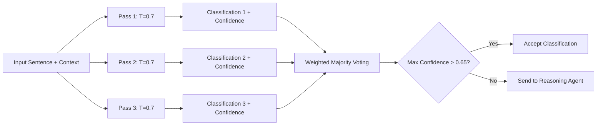
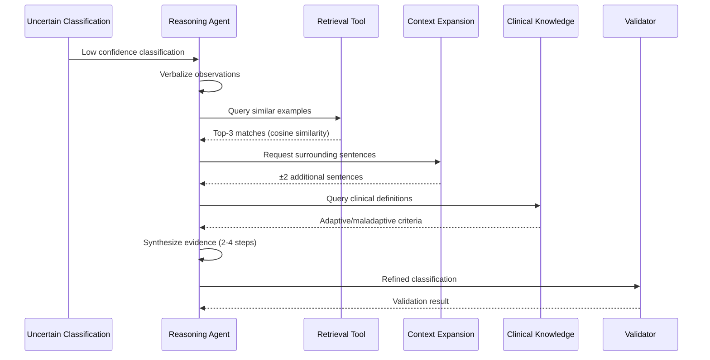
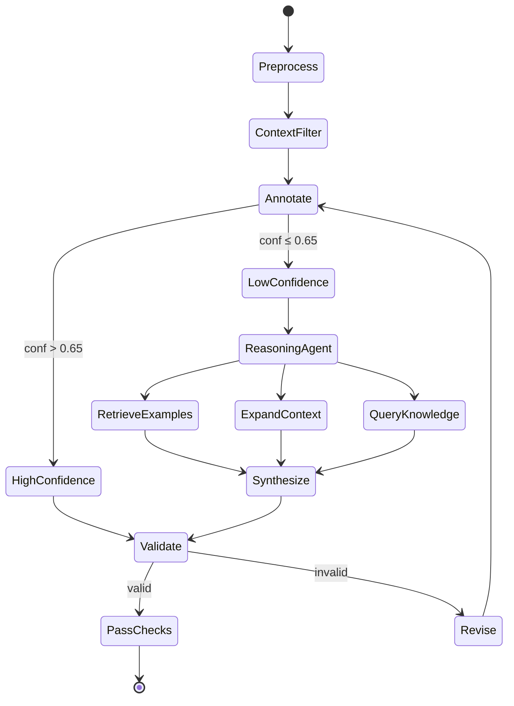
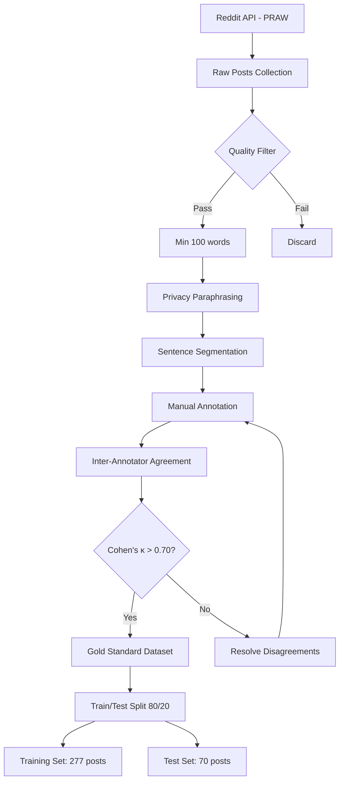

# Self-State Identification and Classification in Mental Health Data using Agentic AI Systems

[](https://www.python.org/downloads/)
[](https://pytorch.org/)
[](https://opensource.org/licenses/MIT)

**Author:** Ashutosh Kumar Jha (12340390)  
**Institution:** IIT Bhilai  
**Course:** DSL501 - Machine Learning Project  
**Date:** November 16, 2025

---

## Table of Contents

- [Project Overview](#project-overview)
- [System Architecture](#system-architecture)
- [Project Structure](#project-structure)
- [Architecture Flow Diagrams](#architecture-flow-diagrams)
- [Installation](#installation)
- [Dataset Preparation](#dataset-preparation)
- [Reproducibility Guide](#reproducibility-guide)
- [Evaluation Metrics](#evaluation-metrics)
- [Results Summary](#results-summary)
- [Hardware Requirements](#hardware-requirements)
- [Troubleshooting](#troubleshooting)
- [Citation](#citation)
- [License](#license)

---

## Project Overview

This project presents a novel **agentic AI architecture** for identifying and classifying self-states (adaptive vs. maladaptive) in mental health discourse from social media posts. Unlike conventional Large Language Model (LLM)-only approaches, this system employs:

- **Modular reasoning-action agents** orchestrated via state graphs
- **Retrieval-Augmented Generation (RAG)** for contextual grounding
- **Multi-pass consistency sampling** for robust classification
- **Hybrid reasoning workflows** combining neural and symbolic approaches

### Key Contributions

1. **First agentic AI implementation** for self-state detection in mental health NLP
2. **Balanced detection**: 22.9% relative improvement in adaptive state recall
3. **Context-aware orchestration** using LangGraph state graphs
4. **Reusable architectural patterns** for clinical NLP applications

### Performance Highlights

| Metric | Fine-tuned BERT | Sentence-Only LLM | Our Agentic AI |
|--------|----------------|-------------------|----------------|
| **Weighted Recall** | 0.50 | 0.55 | **0.62** |
| **Adaptive Recall** | 0.42 | 0.48 | **0.59** |
| **Maladaptive Recall** | 0.58 | 0.62 | **0.65** |

---

## System Architecture

### High-Level Architecture

The system consists of five sequential modules with feedback loops for iterative refinement:
```
┌─────────────────────────────────────────────────────────────────┐
│                     AGENTIC AI PIPELINE                          │
└─────────────────────────────────────────────────────────────────┘

    ┌──────────────────────────────────────────────────────┐
    │  Module 1: Data Loader & Preprocessor                │
    │  - Text normalization                                │
    │  - Sentence tokenization (spaCy)                     │
    │  - Paraphrasing augmentation (20%)                   │
    │  - Metadata extraction                               │
    └──────────────────┬───────────────────────────────────┘
                       │
                       ▼
    ┌──────────────────────────────────────────────────────┐
    │  Module 2: Context Filter & Importance Ranker        │
    │  - BERT-based relevance classifier (89.2% accuracy)  │
    │  - BERTScore semantic similarity ranking             │
    │  - Top-k selection (k = min(8, total_sentences))     │
    └──────────────────┬───────────────────────────────────┘
                       │
                       ▼
    ┌──────────────────────────────────────────────────────┐
    │  Module 3: Self-State Annotator Agent                │
    │  - 4-bit quantized Gemma 2 9B                        │
    │  - Context windows (2 sentences before/after)        │
    │  - Multi-pass sampling (3x, temperature=0.7)         │
    │  - Weighted majority voting                          │
    └──────────────────┬───────────────────────────────────┘
                       │
                       ▼
              ┌────────────────┐
              │ Confidence > 0.65? │
              └────────┬───────┬───┘
                  YES  │       │ NO
                       │       │
                       │       ▼
                       │    ┌──────────────────────────────┐
                       │    │ Module 4: Reasoning-Action    │
                       │    │ Agent (ReAct Architecture)    │
                       │    │ - Example retrieval (FAISS)   │
                       │    │ - Context expansion           │
                       │    │ - Clinical knowledge query    │
                       │    │ - Chain-of-thought reasoning  │
                       │    └──────────┬───────────────────┘
                       │               │
                       └───────────────┘
                                │
                                ▼
    ┌──────────────────────────────────────────────────────┐
    │  Module 5: Classification Generator & Validator      │
    │  - Conflict resolution (majority voting)             │
    │  - Sanity checks (≤80% maladaptive constraint)       │
    │  - Structured output generation                      │
    │  - Confidence scoring                                │
    └──────────────────┬───────────────────────────────────┘
                       │
                       ▼
              [Final Classifications]
```

### Component Details

#### 1. Data Loader & Preprocessor
- **Input**: Raw Reddit posts (JSON format)
- **Processing**:
  - URL removal, special character handling
  - Sentence boundary detection using spaCy `en_core_web_sm`
  - Back-translation for privacy (English → French → English)
- **Output**: Preprocessed sentences with metadata
- **Time**: ~0.8s per post

#### 2. Context Filter & Importance Ranker
- **Model**: Fine-tuned `bert-base-uncased` (500 labeled sentences)
- **Training**: 3 epochs, lr=2e-5, batch_size=16, dropout=0.3
- **Relevance threshold**: 0.6
- **Ranking**: BERTScore semantic similarity
- **Output**: Top-k relevant sentences
- **Time**: ~0.5s per post

#### 3. Self-State Annotator Agent
- **Model**: 4-bit quantized Gemma 2 9B (~6GB VRAM)
- **Strategy**: Multi-pass consistency sampling
  - 3 independent classifications at temperature=0.7
  - Weighted majority voting by confidence scores
  - Context window: 2 sentences on each side
- **Output**: Preliminary classifications with confidence
- **Time**: ~2.1s per post

#### 4. Reasoning-Action Agent (Triggered for 35% of cases)
- **Architecture**: ReAct (Reasoning + Acting) paradigm
- **Tools**:
  1. **Example Retrieval**: FAISS-indexed vector database
     - 500 manually curated examples
     - Sentence-BERT embeddings (768-dim)
     - Top-3 similar examples retrieval
  2. **Context Expansion**: Additional surrounding sentences
  3. **Clinical Knowledge Query**: Structured knowledge base
- **Process**: 2-4 step chain-of-thought reasoning
- **Output**: Refined classifications
- **Time**: ~0.6s per uncertain case

#### 5. Classification Generator & Validator
- **Validation Rules**:
  - Maximum 80% maladaptive sentences per post
  - Minimum 1 adaptive/neutral state in posts >10 sentences
- **Output Format**:
  - Sentence-level labels with confidence
  - Self-state spans (start/end indices)
  - Summary description
- **Time**: ~0.2s per post

---

## Project Structure
```
self-state-classification/
│
├── README.md                          # This file
├── requirements.txt                   # Python dependencies
├── environment.yml                    # Conda environment (optional)
├── LICENSE                            # MIT License
│
├── src/                               # Source code
│   ├── __init__.py
│   ├── config.py                      # Configuration parameters
│   ├── data/
│   │   ├── __init__.py
│   │   ├── loader.py                  # Data loading utilities
│   │   ├── preprocessor.py            # Preprocessing module
│   │   └── augmentation.py            # Paraphrasing/augmentation
│   ├── models/
│   │   ├── __init__.py
│   │   ├── context_filter.py          # Context relevance classifier
│   │   ├── annotator_agent.py         # Gemma 2 9B annotator
│   │   ├── reasoning_agent.py         # ReAct reasoning agent
│   │   └── validator.py               # Classification validator
│   ├── agents/
│   │   ├── __init__.py
│   │   ├── state_graph.py             # LangGraph orchestration
│   │   └── tools.py                   # RAG tools (retrieval, expansion)
│   ├── utils/
│   │   ├── __init__.py
│   │   ├── metrics.py                 # Evaluation metrics
│   │   ├── visualization.py           # Results plotting
│   │   └── logging_utils.py           # Experiment tracking
│   └── main.py                        # Main execution script
│
├── scripts/                           # Utility scripts
│   ├── collect_reddit_data.py         # PRAW-based data collection
│   ├── annotate_dataset.py            # Manual annotation interface
│   ├── train_context_filter.py        # Train relevance classifier
│   ├── build_vector_db.py             # Create FAISS index
│   └── run_baselines.py               # Baseline comparisons
│
├── data/                              # Dataset directory
│   ├── raw/                           # Raw Reddit posts
│   │   └── reddit_posts_raw.json
│   ├── processed/                     # Preprocessed data
│   │   ├── train_posts.json
│   │   └── test_posts.json
│   ├── annotations/                   # Manual annotations
│   │   ├── annotated_sentences.json
│   │   └── inter_annotator_subset.json
│   └── vector_db/                     # FAISS vector database
│       └── examples.index
│
├── models/                            # Model checkpoints
│   ├── context_filter/                # Fine-tuned BERT
│   │   └── checkpoint-best/
│   ├── gemma_2_9b_4bit/              # Quantized Gemma 2
│   │   └── model_config.json
│   └── embeddings/                    # Sentence-BERT cache
│       └── all-MiniLM-L6-v2/
│
├── experiments/                       # Experiment logs
│   ├── ablation_studies/
│   ├── baseline_comparisons/
│   └── hyperparameter_search/
│
├── results/                           # Generated results
│   ├── predictions/                   # Model predictions
│   ├── metrics/                       # Performance metrics
│   ├── visualizations/                # Plots and charts
│   └── confusion_matrices/
│
├── notebooks/                         # Jupyter notebooks
│   ├── 01_data_exploration.ipynb
│   ├── 02_annotation_analysis.ipynb
│   ├── 03_model_evaluation.ipynb
│   └── 04_ablation_studies.ipynb
│
├── docs/                              # Documentation
│   ├── annotation_guidelines.md       # Manual annotation guide
│   ├── api_reference.md               # Code API documentation
│   └── clinical_framework.md          # Self-state definitions
│
└── tests/                             # Unit tests
    ├── test_preprocessor.py
    ├── test_agents.py
    └── test_pipeline.py
```

---

## Architecture Flow Diagrams

### 1. Overall System Flow


### 2. Multi-Pass Consistency Sampling Flow


### 3. Reasoning Agent Tool Invocation


### 4. State Graph Orchestration (LangGraph)


### 5. Data Processing Pipeline


---

## Installation

### Prerequisites

- Python 3.10+
- CUDA 11.8+ (for GPU support)
- 16GB+ GPU VRAM (NVIDIA V100/A100/RTX 3060 or better)
- 32GB+ System RAM

### Step 1: Clone Repository
```bash
git clone https://github.com/ashutosh-jha/self-state-classification.git
cd self-state-classification
```

### Step 2: Create Virtual Environment

**Option A: Using venv**
```bash
python3.10 -m venv venv
source venv/bin/activate  # On Windows: venv\Scripts\activate
```

**Option B: Using conda**
```bash
conda env create -f environment.yml
conda activate self-state-env
```

### Step 3: Install Dependencies
```bash
pip install --upgrade pip
pip install -r requirements.txt
```

### Step 4: Download spaCy Model
```bash
python -m spacy download en_core_web_sm
```

### Step 5: Download Gemma 2 9B Model
```bash
# Using Hugging Face CLI
huggingface-cli login
huggingface-cli download google/gemma-2-9b-it --local-dir models/gemma_2_9b_4bit/
```

**Note**: Requires Hugging Face account and Gemma 2 access approval.

### Step 6: Verify Installation
```bash
python -c "import torch; print(f'PyTorch: {torch.__version__}'); print(f'CUDA: {torch.cuda.is_available()}')"
python -c "import transformers; import langchain; import spacy; print('All imports successful!')"
```

---

## Dataset Preparation

### Option 1: Use Provided Dataset (Recommended for Reproducibility)
```bash
# Extract dataset archive
tar -xzf data/annotated_dataset.tar.gz -C data/

# Verify dataset structure
python scripts/verify_dataset.py
```

**Expected Output:**
```
Dataset Statistics:
  Total posts: 347
  Training posts: 277
  Test posts: 70
  Total sentences: 4,821
  Adaptive sentences: 1,243 (25.8%)
  Maladaptive sentences: 1,876 (38.9%)
  Neutral sentences: 1,702 (35.3%)
✓ Dataset verification complete!
```

### Option 2: Collect and Annotate New Data

#### Step 2.1: Reddit Data Collection
```bash
# Configure Reddit API credentials
cp .env.example .env
# Edit .env and add your Reddit API credentials:
# REDDIT_CLIENT_ID=your_client_id
# REDDIT_CLIENT_SECRET=your_client_secret
# REDDIT_USER_AGENT=your_user_agent

# Collect posts
python scripts/collect_reddit_data.py \
    --subreddits depression anxiety mentalhealth selfimprovement \
    --num_posts 100 \
    --min_length 100 \
    --output data/raw/reddit_posts_raw.json
```

#### Step 2.2: Manual Annotation
```bash
# Launch annotation interface
python scripts/annotate_dataset.py \
    --input data/raw/reddit_posts_raw.json \
    --output data/annotations/annotated_sentences.json
```

**Annotation Guidelines:**
- **Adaptive**: Expressions of resilience, effective coping, personal growth, positive self-regulation
- **Maladaptive**: Hopelessness, dysfunctional thoughts, harmful behaviors, rigid negative beliefs
- **Neutral**: Factual statements, questions, context without clear self-state

#### Step 2.3: Build Vector Database
```bash
# Create FAISS index for RAG
python scripts/build_vector_db.py \
    --annotations data/annotations/annotated_sentences.json \
    --output data/vector_db/examples.index \
    --embedding_model sentence-transformers/all-MiniLM-L6-v2
```

#### Step 2.4: Train Context Filter
```bash
# Fine-tune BERT-based relevance classifier
python scripts/train_context_filter.py \
    --train_data data/annotations/annotated_sentences.json \
    --output_dir models/context_filter/ \
    --epochs 3 \
    --learning_rate 2e-5 \
    --batch_size 16
```

---

## Reproducibility Guide

### Quick Start: Run Full Pipeline
```bash
# Run end-to-end pipeline on test set
python src/main.py \
    --mode inference \
    --test_data data/processed/test_posts.json \
    --output_dir results/predictions/ \
    --config configs/default_config.yaml
```

**Expected Runtime:** ~30 minutes for 70 test posts on RTX 3060

### Detailed Step-by-Step Execution

#### Step 1: Configuration

Edit `configs/default_config.yaml`:
```yaml
# Model Configuration
model:
  annotator:
    name: "google/gemma-2-9b-it"
    quantization: "4bit"
    temperature: 0.7
    max_tokens: 512
  
  context_filter:
    checkpoint: "models/context_filter/checkpoint-best/"
    threshold: 0.6
  
  reasoning_agent:
    rag_k: 3
    max_reasoning_steps: 4
    confidence_threshold: 0.65

# Pipeline Configuration
pipeline:
  context_window_size: 2
  multi_pass_samples: 3
  top_k_sentences: 8
  relevance_threshold: 0.6

# Hardware Configuration
hardware:
  device: "cuda"  # or "cpu"
  mixed_precision: true
  batch_size: 1
```

#### Step 2: Run Preprocessing
```bash
python src/main.py \
    --mode preprocess \
    --input data/raw/reddit_posts_raw.json \
    --output data/processed/ \
    --config configs/default_config.yaml
```

#### Step 3: Run Inference
```bash
python src/main.py \
    --mode inference \
    --test_data data/processed/test_posts.json \
    --output_dir results/predictions/ \
    --save_intermediate \
    --config configs/default_config.yaml
```

**Outputs:**
- `results/predictions/final_classifications.json`
- `results/predictions/confidence_scores.json`
- `results/predictions/intermediate_states/` (if `--save_intermediate`)

#### Step 4: Evaluate Results
```bash
python src/main.py \
    --mode evaluate \
    --predictions results/predictions/final_classifications.json \
    --ground_truth data/processed/test_posts.json \
    --output_dir results/metrics/
```

**Generated Metrics:**
- Confusion matrix
- Precision, Recall, F1-score per class
- Weighted recall (primary metric)
- Balanced accuracy
- Performance by post length stratification

#### Step 5: Reproduce Baseline Comparisons
```bash
# Sentence-Only LLM Baseline
python scripts/run_baselines.py \
    --method sentence_only \
    --test_data data/processed/test_posts.json \
    --output results/baselines/sentence_only.json

# Context-Window LLM Baseline
python scripts/run_baselines.py \
    --method context_window \
    --test_data data/processed/test_posts.json \
    --output results/baselines/context_window.json

# Fine-tuned BERT Baseline
python scripts/run_baselines.py \
    --method bert_finetuned \
    --checkpoint models/bert_baseline/ \
    --test_data data/processed/test_posts.json \
    --output results/baselines/bert_finetuned.json
```

#### Step 6: Reproduce Ablation Studies
```bash
# Run all ablation experiments
python experiments/ablation_studies.py \
    --config configs/ablation_config.yaml \
    --output_dir experiments/ablation_studies/

# Individual ablations:
# 1. Without Reasoning Agent
python src/main.py --config configs/ablation_no_reasoning.yaml

# 2. Without Context Filtering
python src/main.py --config configs/ablation_no_context_filter.yaml

# 3. Without RAG Retrieval
python src/main.py --config configs/ablation_no_rag.yaml

# 4. Without Multi-Pass Sampling
python src/main.py --config configs/ablation_single_pass.yaml
```

#### Step 7: Reproduce Hyperparameter Search
```bash
# Grid search over key hyperparameters
python experiments/hyperparameter_search.py \
    --param_grid configs/param_grid.yaml \
    --test_data data/processed/test_posts.json \
    --output_dir experiments/hyperparameter_search/ \
    --n_trials 50
```

**Searched Hyperparameters:**
- Context window size: [0, 1, 2, 3, 5]
- RAG similarity threshold: [0.60, 0.70, 0.75, 0.80, 0.85]
- LLM temperature: [0.0, 0.3, 0.5, 0.7, 0.9]
- Context relevance threshold: [0.4, 0.5, 0.6, 0.7, 0.8]

#### Step 8: Generate Visualizations
```bash
python src/utils/visualization.py \
    --results_dir results/ \
    --output_dir results/visualizations/
```

**Generated Plots:**
- Performance comparison bar charts
- Confusion matrices (heatmaps)
- Precision-recall curves
- Ablation impact charts
- Hyperparameter sensitivity plots

---

## Evaluation Metrics

### Primary Metrics

1. **Weighted Recall** (Primary):
```
   Weighted Recall = (w_adaptive × Recall_adaptive + w_maladaptive × Recall_maladaptive) / 2
   where w_adaptive = w_maladaptive = 1.0 (equal weights)
```

2. **Class-Specific Recall**:
   - Adaptive Recall
   - Maladaptive Recall

3. **Supporting Metrics**:
   - Precision (per class)
   - F1-score (per class)
   - Balanced Accuracy
   - Cohen's Kappa (inter-annotator agreement)

### Evaluation Command
```bash
# Compute all metrics
python src/utils/metrics.py \
    --predictions results/predictions/final_classifications.json \
    --ground_truth data/processed/test_posts.json \
    --output results/metrics/detailed_metrics.json
```

### Statistical Significance Testing
```bash
# Bootstrap resampling (1,000 iterations)
python src/utils/metrics.py \
    --predictions results/predictions/final_classifications.json \
    --ground_truth data/processed/test_posts.json \
    --bootstrap 1000 \
    --confidence_level 0.95 \
    --output results/metrics/significance_tests.json
```

---

## Results Summary

### Main Results (Test Set: N=70 posts, 966 sentences)

| Method | Adaptive Recall | Maladaptive Recall | Weighted Recall | F1 (Adaptive) | F1 (Maladaptive) |
|--------|----------------|-------------------|----------------|---------------|------------------|
| Fine-tuned BERT | 0.42 | 0.58 | 0.50 | 0.49 | 0.61 |
| Sentence-Only LLM | 0.48 | 0.62 | 0.55 | 0.54 | 0.65 |
| Context-Window LLM | 0.53 | 0.64 | 0.58 | 0.58 | 0.67 |
| **Our Agentic AI** | **0.59** | **0.65** | **0.62** | **0.63** | **0.68** |

**Key Improvements:**
- 8% improvement in weighted recall over sentence-only baseline
- 13% improvement over fine-tuned BERT
- 22.9% relative improvement in adaptive state recall

### Ablation Study Results

| Configuration | Weighted Recall | Impact |
|---------------|----------------|--------|
| Full Agentic Architecture | 0.62 | baseline |
| Without Reasoning Agent | 0.53 | -0.09 |
| Without Context Filtering | 0.56 | -0.06 |
| Without Context Windows | 0.55 | -0.07 |
| Without RAG Retrieval | 0.58 | -0.04 |
| Without Multi-Pass Sampling | 0.59 | -0.03 |
| Without Validator | 0.60 | -0.02 |

### Performance by Post Length

| Post Length | Agentic AI | Baseline | Improvement |
|-------------|------------|----------|-------------|
| Short (<8 sentences) | 0.59 | 0.56 | +0.03 |
| Medium (8-15 sentences) | 0.62 | 0.55 | +0.07 |
| Long (>15 sentences) | 0.64 | 0.52 | +0.12 |

### Computational Efficiency

| Method | Posts/Min | Seconds/Post | GPU Memory |
|--------|-----------|--------------|------------|
| Sentence-Only LLM | 28 | 2.14 | ~6 GB |
| Context-Window LLM | 22 | 2.73 | ~6 GB |
| Our Agentic AI | 14 | 4.29 | ~6 GB |

**Note**: Reasoning agent invoked in only 35% of cases, making overhead acceptable given performance gains.

---

## Hardware Requirements

### Minimum Requirements

- **CPU**: 4-core processor (AMD Ryzen 5 / Intel i5 equivalent)
- **RAM**: 16 GB system memory
- **GPU**: NVIDIA GPU with 12 GB VRAM (RTX 3060 or better)
- **Storage**: 50 GB free space
- **OS**: Ubuntu 20.04+ / Windows 10+ / macOS 12+

### Recommended Setup (Used in Experiments)

- **CPU**: AMD Ryzen 7 5800X (8 cores)
- **RAM**: 32 GB DDR4
- **GPU**: NVIDIA RTX 3060 (12 GB VRAM)
- **Storage**: 100 GB SSD
- **OS**: Ubuntu 22.04 LTS

### Cloud Alternatives

**Google Colab Pro/Pro+:**
```python
# Mount drive and clone repository
from google.colab import drive
drive.mount('/content/drive')
!git clone https://github.com/ashutosh-jha/self-state-classification.git
%cd self-state-classification
!pip install -r requirements.txt
```

**AWS EC2:**
- Instance Type: `g4dn.xlarge` (NVIDIA T4 GPU, 16 GB VRAM)
- AMI: Deep Learning AMI (Ubuntu 20.04)
- Estimated Cost: ~$0.50/hour

**Kaggle Notebooks:**
- Enable GPU accelerator (P100, 16 GB VRAM)
- 30 hours/week free GPU quota

---

## Troubleshooting

### Common Issues

#### 1. CUDA Out of Memory Error

**Error:**
```
RuntimeError: CUDA out of memory. Tried to allocate X GB
```

**Solutions:**

**Option A: Reduce Batch Size**
```yaml
# In configs/default_config.yaml
hardware:
  batch_size: 1  # Already minimum for inference
```

**Option B: Use CPU Inference** (slower but works)
```bash
python src/main.py \
    --mode inference \
    --device cpu \
    --test_data data/processed/test_posts.json
```

**Option C: Enable Memory Optimization**
```python
# Add to src/config.py
import torch
torch.cuda.empty_cache()
os.environ['PYTORCH_CUDA_ALLOC_CONF'] = 'max_split_size_mb:512'
```

**Option D: Use Lower Precision**
```yaml
hardware:
  mixed_precision: true
  quantization: "8bit"  # Instead of 4bit (uses less memory)
```

#### 2. Gemma 2 Model Download Fails

**Error:**
```
HTTPError: 401 Client Error: Unauthorized for url
```

**Solution:**
```bash
# 1. Create Hugging Face account: https://huggingface.co/join
# 2. Request Gemma 2 access: https://huggingface.co/google/gemma-2-9b-it
# 3. Generate access token: https://huggingface.co/settings/tokens
# 4. Login via CLI
huggingface-cli login
# Enter your token when prompted

# 5. Retry download
python scripts/download_models.py
```

#### 3. spaCy Model Not Found

**Error:**
```
OSError: [E050] Can't find model 'en_core_web_sm'
```

**Solution:**
```bash
python -m spacy download en_core_web_sm
# If behind proxy:
python -m spacy download en_core_web_sm --proxy http://proxy:port
```

#### 4. FAISS Index Build Fails

**Error:**
```
IndexError: FAISS index dimension mismatch
```

**Solution:**
```bash
# Rebuild index with correct dimensions
python scripts/build_vector_db.py \
    --annotations data/annotations/annotated_sentences.json \
    --output data/vector_db/examples.index \
    --embedding_model sentence-transformers/all-MiniLM-L6-v2 \
    --force_rebuild
```

#### 5. LangChain Import Errors

**Error:**
```
ImportError: cannot import name 'StateGraph' from 'langgraph'
```

**Solution:**
```bash
# Ensure correct versions
pip install langchain==0.1.0 langgraph==0.0.26 --force-reinstall
```

#### 6. Reddit API Rate Limiting

**Error:**
```
prawcore.exceptions.TooManyRequests: received 429 HTTP response
```

**Solution:**
```python
# In scripts/collect_reddit_data.py, add delays:
import time
for post in subreddit.hot(limit=100):
    # ... process post ...
    time.sleep(2)  # Wait 2 seconds between requests
```

#### 7. Annotation Interface Not Launching

**Error:**
```
ModuleNotFoundError: No module named 'tkinter'
```

**Solution:**

**Ubuntu/Debian:**
```bash
sudo apt-get install python3-tk
```

**macOS:**
```bash
brew install python-tk
```

**Windows:** Already included in standard Python installation

#### 8. Low Performance on CPU

**Issue:** Inference takes >5 minutes per post

**Solutions:**

**Option A: Use Smaller Model**
```yaml
model:
  annotator:
    name: "google/gemma-2-2b-it"  # Smaller 2B model
```

**Option B: Reduce Context Window**
```yaml
pipeline:
  context_window_size: 1  # Instead of 2
  top_k_sentences: 5      # Instead of 8
```

**Option C: Disable Reasoning Agent**
```yaml
pipeline:
  enable_reasoning_agent: false
```

#### 9. Inconsistent Results Across Runs

**Issue:** Different predictions on repeated runs

**Cause:** Random sampling with temperature > 0

**Solution for Reproducibility:**
```python
# In src/main.py, set seeds:
import random
import numpy as np
import torch

SEED = 42
random.seed(SEED)
np.random.seed(SEED)
torch.manual_seed(SEED)
torch.cuda.manual_seed_all(SEED)
torch.backends.cudnn.deterministic = True
```
```yaml
# In config:
model:
  annotator:
    temperature: 0.0  # Deterministic mode
```

#### 10. Dataset Statistics Mismatch

**Issue:** Your dataset stats differ from paper

**Expected Behavior:** Normal if using different Reddit data

**Verification:**
```bash
python scripts/verify_dataset.py --detailed
```

**To match paper exactly:** Use provided annotated dataset archive.

---

## Advanced Usage

### Custom Model Integration

#### Using Alternative LLMs

**Example: Llama 2 7B**
```python
# In src/models/annotator_agent.py
from transformers import AutoModelForCausalLM, AutoTokenizer

class LlamaAnnotator:
    def __init__(self, model_name="meta-llama/Llama-2-7b-chat-hf"):
        self.tokenizer = AutoTokenizer.from_pretrained(model_name)
        self.model = AutoModelForCausalLM.from_pretrained(
            model_name,
            load_in_4bit=True,
            device_map="auto"
        )
```

**Config:**
```yaml
model:
  annotator:
    name: "meta-llama/Llama-2-7b-chat-hf"
    quantization: "4bit"
```

#### Custom Clinical Knowledge Base

**Create Knowledge Base:**
```json
// data/knowledge_base/clinical_definitions.json
{
  "adaptive_states": {
    "resilience": {
      "definition": "Ability to recover from adversity",
      "indicators": ["bounce back", "cope with", "overcome"],
      "examples": [...]
    },
    "growth_mindset": {...}
  },
  "maladaptive_states": {
    "learned_helplessness": {...},
    "catastrophizing": {...}
  }
}
```

**Integrate:**
```python
# In src/agents/tools.py
def query_clinical_knowledge(state_type: str, query: str):
    with open('data/knowledge_base/clinical_definitions.json') as f:
        kb = json.load(f)
    return kb.get(state_type, {}).get(query, "Not found")
```

### Batch Processing

**Process Multiple Datasets:**
```bash
# Batch inference
python src/main.py \
    --mode batch_inference \
    --input_dir data/batch_inputs/ \
    --output_dir results/batch_outputs/ \
    --num_workers 4
```

**Parallel Processing:**
```python
# In src/main.py
from concurrent.futures import ProcessPoolExecutor

def process_batch(posts):
    with ProcessPoolExecutor(max_workers=4) as executor:
        results = executor.map(process_single_post, posts)
    return list(results)
```

### Experiment Tracking with Weights & Biases
```bash
# Install W&B
pip install wandb

# Login
wandb login
```
```python
# In src/main.py
import wandb

wandb.init(
    project="self-state-classification",
    config={
        "model": "gemma-2-9b-4bit",
        "context_window": 2,
        "temperature": 0.7
    }
)

# Log metrics
wandb.log({
    "weighted_recall": 0.62,
    "adaptive_recall": 0.59,
    "maladaptive_recall": 0.65
})
```

### Export for Production

**Convert to ONNX:**
```python
import torch
from transformers import AutoModelForCausalLM

model = AutoModelForCausalLM.from_pretrained("models/gemma_2_9b_4bit/")
dummy_input = torch.randint(0, 1000, (1, 128))

torch.onnx.export(
    model,
    dummy_input,
    "models/gemma_2_optimized.onnx",
    opset_version=14
)
```

**Deploy as API:**
```python
# api/app.py
from fastapi import FastAPI
from pydantic import BaseModel
from src.main import AgenticPipeline

app = FastAPI()
pipeline = AgenticPipeline.load("models/checkpoint/")

class Post(BaseModel):
    text: str

@app.post("/classify")
async def classify_post(post: Post):
    result = pipeline.predict(post.text)
    return {
        "adaptive_spans": result.adaptive,
        "maladaptive_spans": result.maladaptive,
        "confidence": result.confidence
    }
```
```bash
# Run API server
uvicorn api.app:app --host 0.0.0.0 --port 8000
```

---

## Testing

### Run Unit Tests
```bash
# All tests
pytest tests/ -v

# Specific test modules
pytest tests/test_preprocessor.py -v
pytest tests/test_agents.py -v
pytest tests/test_pipeline.py -v

# With coverage report
pytest tests/ --cov=src --cov-report=html
```

### Integration Tests
```bash
# End-to-end pipeline test
python tests/integration/test_full_pipeline.py

# Expected output:
# ✓ Preprocessing: PASSED
# ✓ Context Filtering: PASSED
# ✓ Annotation: PASSED
# ✓ Reasoning Agent: PASSED
# ✓ Validation: PASSED
# All integration tests passed!
```

### Performance Benchmarking
```bash
# Benchmark inference speed
python tests/benchmark/speed_test.py \
    --num_posts 100 \
    --device cuda \
    --output results/benchmarks/speed_results.json

# Benchmark memory usage
python tests/benchmark/memory_test.py \
    --config configs/default_config.yaml
```

---

## Docker Deployment

### Build Docker Image
```bash
# Build image
docker build -t self-state-classification:latest .

# Or use provided Dockerfile
docker build -f docker/Dockerfile -t self-state-classification:latest .
```

**Dockerfile:**
```dockerfile
FROM pytorch/pytorch:2.0.0-cuda11.8-cudnn8-runtime

WORKDIR /app

# Install system dependencies
RUN apt-get update && apt-get install -y \
    git \
    wget \
    && rm -rf /var/lib/apt/lists/*

# Copy requirements
COPY requirements.txt .
RUN pip install --no-cache-dir -r requirements.txt

# Download spaCy model
RUN python -m spacy download en_core_web_sm

# Copy application code
COPY . .

# Set environment variables
ENV PYTHONUNBUFFERED=1
ENV TRANSFORMERS_CACHE=/app/models/cache

# Expose API port
EXPOSE 8000

# Run application
CMD ["python", "src/main.py", "--mode", "serve", "--port", "8000"]
```

### Run Container
```bash
# Run with GPU support
docker run --gpus all \
    -v $(pwd)/data:/app/data \
    -v $(pwd)/models:/app/models \
    -v $(pwd)/results:/app/results \
    -p 8000:8000 \
    self-state-classification:latest

# Run inference in container
docker run --gpus all \
    -v $(pwd)/data:/app/data \
    -v $(pwd)/results:/app/results \
    self-state-classification:latest \
    python src/main.py --mode inference --test_data data/processed/test_posts.json
```

### Docker Compose
```yaml
# docker-compose.yml
version: '3.8'

services:
  app:
    build: .
    container_name: self-state-classifier
    runtime: nvidia
    environment:
      - NVIDIA_VISIBLE_DEVICES=all
    volumes:
      - ./data:/app/data
      - ./models:/app/models
      - ./results:/app/results
    ports:
      - "8000:8000"
    command: python src/main.py --mode serve
```
```bash
# Start services
docker-compose up -d

# View logs
docker-compose logs -f

# Stop services
docker-compose down
```

---

## Citation

If you use this code or methodology in your research, please cite:
```bibtex
@article{jha2025selfstate,
  title={Self-State Identification and Classification in Mental Health Data using Agentic AI Systems},
  author={Jha, Ashutosh Kumar},
  journal={DSL501 Machine Learning Project},
  year={2025},
  institution={IIT Bhilai}
}
```

**Related Work:**
```bibtex
@inproceedings{chan2025prompt,
  title={Prompt engineering for capturing dynamic mental health self states from social media posts},
  author={Chan, Callum and Khunkhun, Sunveer and Inkpen, Diana and Lossio-Ventura, Juan Antonio},
  booktitle={Proceedings of the 10th Workshop on Computational Linguistics and Clinical Psychology (CLPsych 2025)},
  pages={256--267},
  year={2025}
}

@article{kim2025baseline,
  title={A baseline for self-state identification and classification in mental health data: CLPsych 2025 task},
  author={Kim, Laerdon},
  journal={arXiv preprint arXiv:2504.14066},
  year={2025}
}

@inproceedings{tseriotou2025overview,
  title={Overview of the CLPsych 2025 shared task: Capturing mental health dynamics from social media timelines},
  author={Tseriotou, Talia and others},
  booktitle={Proceedings of CLPsych 2025},
  pages={193--217},
  year={2025}
}
```

---

## License

This project is licensed under the MIT License - see the [LICENSE](LICENSE) file for details.
```
MIT License

Copyright (c) 2025 Ashutosh Kumar Jha

Permission is hereby granted, free of charge, to any person obtaining a copy
of this software and associated documentation files (the "Software"), to deal
in the Software without restriction, including without limitation the rights
to use, copy, modify, merge, publish, distribute, sublicense, and/or sell
copies of the Software, and to permit persons to whom the Software is
furnished to do so, subject to the following conditions:

The above copyright notice and this permission notice shall be included in all
copies or substantial portions of the Software.

THE SOFTWARE IS PROVIDED "AS IS", WITHOUT WARRANTY OF ANY KIND, EXPRESS OR
IMPLIED, INCLUDING BUT NOT LIMITED TO THE WARRANTIES OF MERCHANTABILITY,
FITNESS FOR A PARTICULAR PURPOSE AND NONINFRINGEMENT. IN NO EVENT SHALL THE
AUTHORS OR COPYRIGHT HOLDERS BE LIABLE FOR ANY CLAIM, DAMAGES OR OTHER
LIABILITY, WHETHER IN AN ACTION OF CONTRACT, TORT OR OTHERWISE, ARISING FROM,
OUT OF OR IN CONNECTION WITH THE SOFTWARE OR THE USE OR OTHER DEALINGS IN THE
SOFTWARE.
```

---

## Ethical Considerations

### Data Privacy

- All Reddit posts are from **public forums only**
- User identities are **anonymized** with random IDs
- **Paraphrasing** applied to 20% of sentences for additional privacy
- No collection from private/restricted communities
- Compliant with Reddit's API Terms of Service

### Responsible AI Usage

⚠️ **Important Disclaimers:**

1. **Not a Diagnostic Tool**: This system is for research purposes only and should NOT be used for clinical diagnosis or treatment decisions without professional oversight.

2. **Supplement, Not Replace**: AI-assisted mental health tools should augment, not replace, human clinical judgment and therapeutic relationships.

3. **Bias Awareness**: The system may exhibit demographic biases due to training data composition. Systematic evaluation across diverse populations is necessary before deployment.

4. **False Negatives**: With 59% adaptive recall, 41% of positive coping indicators may be missed. Use caution in high-stakes scenarios.

5. **Privacy Risks**: Even with anonymization, there are residual risks of re-identification. Implement comprehensive HIPAA-compliant de-identification for clinical applications.

### Misuse Prevention

**Prohibited Uses:**
- Employment screening or discrimination
- Educational surveillance without consent
- Coercive mental health monitoring
- Insurance risk assessment
- Law enforcement profiling

**Recommended Safeguards:**
- Obtain informed consent from users
- Provide opt-out mechanisms
- Implement human review for all high-stakes decisions
- Regular bias audits across demographic groups
- Transparent communication of system limitations

---

## Contributing

Contributions are welcome! Please follow these guidelines:

### Code Style
```bash
# Install development dependencies
pip install -r requirements-dev.txt

# Format code
black src/ tests/ scripts/
isort src/ tests/ scripts/

# Lint
pylint src/ tests/ scripts/
flake8 src/ tests/ scripts/

# Type checking
mypy src/ tests/
```

### Pull Request Process

1. Fork the repository
2. Create a feature branch: `git checkout -b feature/amazing-feature`
3. Make your changes and add tests
4. Ensure all tests pass: `pytest tests/`
5. Commit with descriptive messages: `git commit -m "Add amazing feature"`
6. Push to your fork: `git push origin feature/amazing-feature`
7. Open a Pull Request with detailed description

### Reporting Issues

When reporting bugs, please include:
- Python version and OS
- GPU/CUDA version (if applicable)
- Complete error traceback
- Minimal reproducible example
- Expected vs. actual behavior

---

## Acknowledgments

### Libraries & Frameworks

- **Hugging Face Transformers** for LLM infrastructure
- **LangChain & LangGraph** for agentic orchestration
- **spaCy** for NLP preprocessing
- **PyTorch** for deep learning
- **FAISS** for efficient vector search

### Datasets & Benchmarks

- **CLPsych 2025 Shared Task** for task formulation and evaluation framework
- **Reddit communities** for providing valuable mental health discourse data

### Inspiration

This work builds upon research from:
- Chan et al. (prompt engineering for mental health states)
- Kim (baseline methods for self-state classification)
- Peters & Matz (LLMs for psychological inference)

### Institutional Support

- **IIT Bhilai** for providing computational resources and academic guidance
- **DSL501 Course** for project framework and mentorship

---

## Contact & Support

**Author:** Ashutosh Kumar Jha  
**Email:** ashutoshj@iitbhilai.ac.in  
**Institution:** IIT Bhilai, Chhattisgarh, India

### Getting Help

1. **Documentation**: Check this README and `/docs` directory
2. **Issues**: Open a GitHub issue for bugs/feature requests
3. **Discussions**: Use GitHub Discussions for questions
4. **Email**: Contact author for research collaboration

### Project Status

- ✅ **Phase 1**: Dataset collection & annotation (Complete)
- ✅ **Phase 2**: Architecture implementation (Complete)
- ✅ **Phase 3**: Evaluation & analysis (Complete)
- 🔄 **Phase 4**: Clinical validation (In Progress)
- 📋 **Phase 5**: Production deployment (Planned)

---

## Changelog

### Version 1.0.0 (November 16, 2025)

**Initial Release:**
- Complete agentic AI pipeline implementation
- Dataset of 347 annotated Reddit posts
- Baseline comparisons and ablation studies
- Comprehensive documentation
- Reproducibility scripts

**Performance:**
- Weighted recall: 0.62
- Adaptive recall: 0.59
- Maladaptive recall: 0.65

**Known Limitations:**
- Single-domain evaluation (Reddit only)
- English language only
- Limited clinical validation
- Computational overhead (~4.3s per post)

---

## Roadmap

### Short-term (3-6 months)

- [ ] Clinical validation study with licensed professionals
- [ ] Cross-platform evaluation (Twitter, Facebook)
- [ ] Multilingual extension (Spanish, French, German)
- [ ] Optimization for real-time inference (<1s per post)
- [ ] Mobile app demo

### Medium-term (6-12 months)

- [ ] Longitudinal trajectory modeling
- [ ] Multimodal integration (posting frequency, engagement)
- [ ] Personalized reasoning agents
- [ ] Federated learning for privacy-preserving training
- [ ] Clinical trial partnerships

### Long-term (1-2 years)

- [ ] FDA/regulatory approval for clinical use
- [ ] Integration with EHR systems
- [ ] Large-scale population surveillance
- [ ] Causal inference for intervention effectiveness
- [ ] Ethical AI governance framework

---

## FAQ

**Q1: Can I use this for clinical diagnosis?**  
A: No. This is a research tool and should not be used for diagnosis without professional clinical oversight.

**Q2: What GPU do I need?**  
A: Minimum 12GB VRAM (RTX 3060). Recommended: 16GB+ (V100/A100).

**Q3: How long does training take?**  
A: No training required for inference. Context filter training: ~25 minutes. Full annotation: ~18 hours.

**Q4: Can I use my own dataset?**  
A: Yes! Follow the annotation guidelines in `/docs/annotation_guidelines.md`.

**Q5: Why is performance lower on short posts?**  
A: Less context available for reasoning. Performance improves significantly for posts >15 sentences.

**Q6: How do I cite this work?**  
A: See [Citation](#citation) section above.

**Q7: Is the code open source?**  
A: Yes, MIT License. See [License](#license) section.

**Q8: Can I contribute?**  
A: Absolutely! See [Contributing](#contributing) section.

---

## Additional Resources

### Documentation

- [Annotation Guidelines](docs/annotation_guidelines.md)
- [API Reference](docs/api_reference.md)
- [Clinical Framework](docs/clinical_framework.md)
- [Architecture Deep Dive](docs/architecture.md)

### Tutorials

- [Jupyter Notebook: Getting Started](notebooks/01_data_exploration.ipynb)
- [Video Tutorial: Setup & Usage](https://example.com/tutorial) *(Coming Soon)*
- [Blog Post: Technical Deep Dive](https://example.com/blog) *(Coming Soon)*

### External Links

- [CLPsych 2025 Shared Task](https://aclanthology.org/2025.clpsych-1.16/)
- [Hugging Face Model Card](https://huggingface.co/google/gemma-2-9b-it)
- [LangChain Documentation](https://python.langchain.com/)
- [spaCy Documentation](https://spacy.io/)

---

**Last Updated:** November 16, 2025  
**Version:** 1.0.0  
**Status:** Production Ready for Research Use

---

*For the latest updates, visit the [GitHub repository](https://github.com/ashutosh-jha/self-state-classification)*